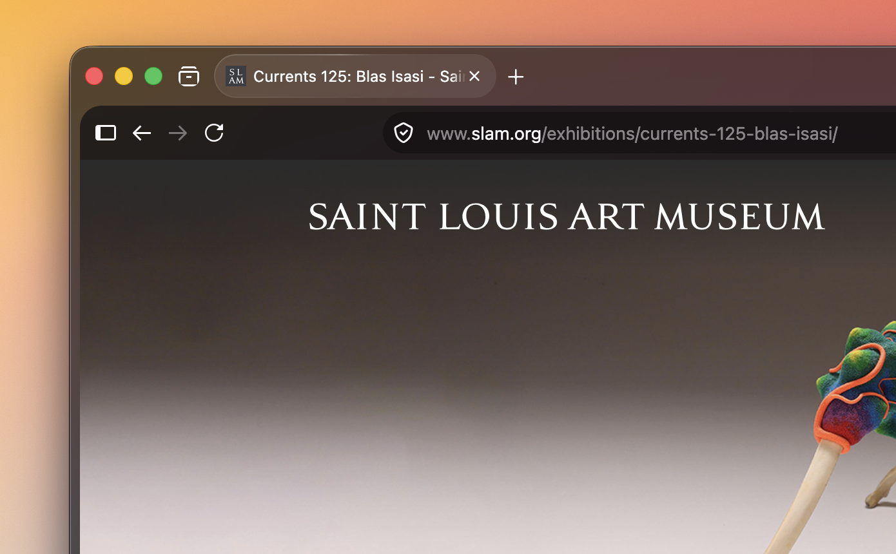

# Liquid Fox

A transparent Firefox theme for macOS. Vibrancy blur, rounded panels, specular glass outlines, gradient tint, and custom tab group styling. Supports both vertical and horizontal tab layouts.



## Features

- **macOS vibrancy blur** behind the entire browser chrome
- **Rounded content panels** with soft shadows and directional specular outlines
- **Gradient tint overlay** across the window backdrop
- **Tab group styling** for both vertical (sidebar) and horizontal layouts
- **Dark mode** with stronger group tints, brighter backdrop, and adjusted specular
- **Collapsed sidebar** overrides for vertical tabs
- **Split view** styling for horizontal tabs
- **Animations** with `prefers-reduced-motion` fallback
- **Optional features** gated behind `about:config` prefs:
  - Auto-hide bookmarks bar
  - Show tab close button on hover only

## Requirements

- macOS
- Firefox 130+

## Install

### One-line install

```bash
curl -sL https://raw.githubusercontent.com/sitapix/liquid-fox/main/install-remote.sh | bash
```

### Local install

```bash
git clone https://github.com/sitapix/liquid-fox.git
cd liquid-fox
./install.sh
```

The script copies the theme into your selected Firefox profile and sets the required `about:config` preferences automatically.

### Manual install

1. Open `about:profiles` in Firefox and find your active profile directory
2. Copy the entire `chrome/` folder into it
3. Set these in `about:config`:

| Preference | Value |
|------------|-------|
| `toolkit.legacyUserProfileCustomizations.stylesheets` | `true` |
| `widget.macos.titlebar-blend-mode.behind-window` | `true` |

4. Restart Firefox

## Customization

Don't edit the theme files directly. Instead, create a `userChrome-overrides.css` file in your profile's `chrome/` directory (see `userChrome-overrides-example.css` for all available variables).

### Presets

Ready-made color schemes are available in `presets/`. Copy one to your profile's `chrome/` directory and rename it to `userChrome-overrides.css`:

| Preset | Description |
|--------|-------------|
| `default.css` | Default Liquid Fox tint |
| `catppuccin-mocha.css` | Catppuccin Mocha |
| `catppuccin-latte.css` | Catppuccin Latte |
| `nord.css` | Nord |
| `rose-pine.css` | Rose Pine |
| `gruvbox.css` | Gruvbox |
| `monochrome.css` | Monochrome |

### Variables

Key `--liquid-*` custom properties you can override:

| Variable | Default | Description |
|----------|---------|-------------|
| `--liquid-radius` | `17px` | Content panel corner radius |
| `--liquid-radius-small` | `8px` | Tabs, buttons, tab groups radius |
| `--liquid-padding` | `8px` | Padding around content panels |
| `--liquid-saturation` | `1.3` | Vibrancy saturation boost (1.0 = off) |
| `--liquid-sidebar-border` | `transparent` | Sidebar border color |
| `--liquid-toolbar-sidebar-offset` | `48.5px` | Toolbar push when sidebar is open |
| `--liquid-sidebar-max-width` | `40vw` | Maximum sidebar width |
| `--liquid-dark-overlay-alpha` | `0.03` | Dark mode white wash intensity |
| `--liquid-dark-sidebar-alpha` | `0.82` | Dark mode sidebar opacity |
| `--liquid-window-tint` | *(gradient)* | Window tint gradient (`none` to disable) |
| `--liquid-transition-speed` | `0.2s` | Sidebar animation speed (keep at 0.2s) |

## Optional Features

Enable in `about:config`, then restart Firefox:

| Preference | Effect |
|------------|--------|
| `liquidFox.autohide.bookmarkbar` | Auto-hide the bookmarks toolbar |
| `liquidFox.tab.close_button_at_hover` | Show tab close button only on hover |

## License

[MIT](LICENSE)
